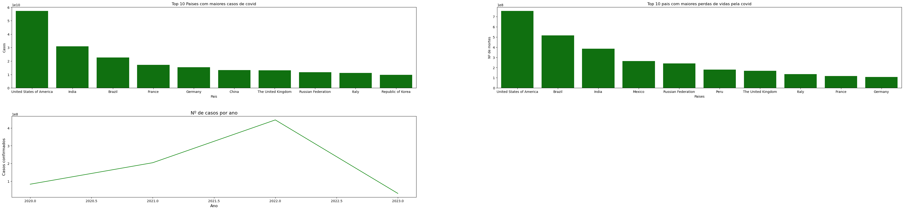

# Análise casos covid

### Objetivo

O objetivo deste projeto e utilizar as linguagem python junto a biblioteca pandas para analisar quais paises mais sofreram com os números de infectados, perdas de vidas pela covid e o periodo que tivemos os maiores casos.

### Tecnologias usadas

Para desenvolver essa análise utilizei a base de dados vinda do Kallgel, para tratar os dados utilizei **python** com a biblioteca **pandas** e para criar os gráficos apresentando os resultados da análise, utilizei a biblioteca **seaborn**

### Resultados  

Foi gerado os seguintes graficos

